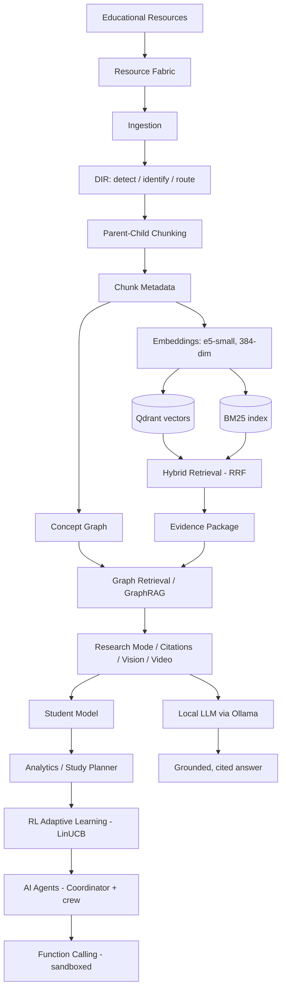

# Digiler AI

**Adaptive AI Learning Assistant with Hybrid RAG, GraphRAG, Multimodal Retrieval, and Personalized Learning.**

Digiler AI is a local-first, production-grade learning platform that answers questions
strictly from a course Knowledge Base — with citations, page/slide/timestamp locators,
and confidence — and adapts to each learner through a student model, a concept graph,
reinforcement-learning-driven difficulty, and a crew of cooperating AI agents. The
language model runs entirely on a **local Ollama server** (default `qwen3`); no external
LLM APIs are required.

---

## 1. Overview

Most "chat with your PDFs" tools hallucinate, cite nothing, and treat every learner the
same. Digiler AI is built the opposite way: answers are **grounded by construction** in
retrieved evidence, every claim is cited to a resolvable source, and the system builds a
per-student model of mastery that personalizes retrieval, recommendations, and practice.

It is a complete stack: an offline-capable Python platform (ingestion, retrieval, graph,
agents), a FastAPI backend that exposes every capability, and a Next.js frontend that
presents a ChatGPT-style experience over the learner's own materials.

## 2. Problem

- **Hallucination and untraceable answers** make LLM tutors unsafe for education.
- **One-size-fits-all** assistants ignore what a student already knows or struggles with.
- **Cloud LLM dependence** raises cost, privacy, and offline concerns for institutions.
- **Multimodal course content** (slides, figures, lecture videos) is rarely retrievable
  with precise locators (page, slide, timestamp).

## 3. Key Contributions

- A **hybrid retrieval + GraphRAG** pipeline that is grounded and cited by construction,
  evaluated to **0.0 hallucination and 1.0 citation accuracy** on the real corpus.
- A **concept graph** (1,511 nodes / 5,091 edges) enabling multi-hop, relationship-aware
  retrieval and explainable "related concepts."
- **Multimodal RAG**: figure/vision retrieval and timestamped video-transcript retrieval.
- A **personalization layer** (student model + learning analytics) driving a
  **LinUCB contextual bandit** for adaptive difficulty.
- A **native multi-agent framework** and a **sandboxed function-calling runtime**, all
  reusing a single retrieval path (no duplicated logic).
- **Local-only LLM** via Ollama with graceful fallback to a grounded extractive generator.

## 4. Main Features

Grounded chat with citations · retrieval-backed summaries · interactive quizzes
(MCQ / true-false / short answer) · semantic + hybrid search · concept-graph exploration ·
confidence-gated Research Mode (web search on approval only) · citation explorer ·
student profile and learning analytics dashboard · study planner (with iCalendar export) ·
RL-adaptive difficulty · AI agents · safe function calling · admin and instructor panels.

## 5. Architecture



Layered as: `src/ala/` (framework-free platform) → `backend/` (thin FastAPI layer over the
platform) → `frontend/` (Next.js client). The architecture baseline (V3) is frozen; changes
are incremental and additive.

## 6. Knowledge Pipeline

`Resource → DIR → parent-child chunking → metadata (schema v2, frozen) → embeddings →
Qdrant + BM25 → concept graph`. Ingestion is incremental and content-addressed: raw
materials are immutable, only `knowledge_base/derived/` is written, and resources are
referenced by `resource_id`.

## 7. Retrieval Pipeline

Dense retrieval (e5-small over Qdrant) and lexical retrieval (BM25) are fused with
Reciprocal Rank Fusion into an **Evidence Package** carrying text, citation, source type,
and page/slide/timestamp. BM25 is the stronger arm on this technical corpus and is
weighted accordingly; the dense arm promotes items both arms agree on.

## 8. GraphRAG

A concept graph links courses, modules, resources, topics, and concepts. Graph retrieval
expands the evidence with related concepts and provenance edges, enabling multi-hop
answers. Answers are grounded and cited; grounding and citation accuracy are validated.

## 9. Research Mode

When Knowledge-Base confidence is low, the system flags that an answer needs external
information. Web search is **never automatic** — the user must approve it. Approved
results are quality-filtered, merged with corpus evidence, and (optionally, on a second
approval) ingested into the Knowledge Base. Default provider is Wikipedia (no key,
bilingual); Tavily/Google are configurable via environment variables.

## 10. Citation System

Every answer carries resolvable citations with deep locators (page, slide, timestamp) and
a confidence score. The Citation Explorer resolves and navigates them.

## 11. Video / Vision RAG

- **Vision**: figures and tables are extracted and made retrievable.
- **Video**: WebVTT/SRT transcripts are parsed into timestamped segments so answers can
  cite an exact moment in a lecture.

## 12. Student Model

A per-student SQLite model tracks concept mastery (EMA), longitudinal learning events, and
weak/strong concepts, driving personalized retrieval and recommendations.

## 13. Learning Analytics

A dashboard (owned by the profile) surfaces mastery by domain, weak/strong concepts,
study time, progress/coverage, and grounded next-step recommendations.

## 14. Study Planner

Generates a curriculum-ordered, deadline-aware study roadmap from a goal, prioritizing
weak concepts, with an iCalendar export.

## 15. RL Adaptive Learning

A **LinUCB contextual bandit** selects question difficulty to keep the learner in their
Zone of Proximal Development, using mastery/recent-accuracy/exposure as context and a
ZPD-shaped reward. Evaluated against fixed and random policies (see Results).

## 16. AI Agents

Seven native agents — **Tutor, Quiz, Evaluator, Planner, Research, WebResearch,
KnowledgeCurator** — coordinated by a keyword-routing Coordinator that also runs a full
study session (tutor → quiz → evaluator → planner). All agents reuse the single GraphRAG
retrieval path.

## 17. Function Calling

A safety-first function runtime: an AST-whitelisted calculator and a restricted,
deadline-bounded Python sandbox, plus knowledge/quiz/plan tools. Mutating tools are
gated to instructor/admin roles.

## 18. Technology Stack

- **Platform**: Python 3.11, Pydantic, Qdrant, sentence-transformers (e5-small), rank-BM25,
  NetworkX, SQLite.
- **Backend**: FastAPI, SQLAlchemy 2.0 (async), JWT (python-jose) + bcrypt, SSE
  (sse-starlette), Uvicorn.
- **Frontend**: Next.js 14 (App Router), TypeScript, TailwindCSS, React Query, Zustand.
- **LLM**: local **Ollama** (default `qwen3`; qwen2.5 / llama3 / mistral / gemma
  supported), with a dependency-free extractive fallback.
- **Deployment**: Docker Compose (postgres / redis / qdrant / ollama / backend / frontend /
  nginx), GitHub Actions CI.

## 19. Dataset / Knowledge Base Policy

The original Digilians academic corpus (third-party PDFs, slides, notes) is **intentionally
excluded** from this repository for copyright and privacy reasons. The platform is
corpus-agnostic — bring your own materials. See [`knowledge_base/README.md`](knowledge_base/README.md).

## 20. Installation

```bash
# clone
git clone https://github.com/<owner>/Digiler-AI.git
cd Digiler-AI

# Python platform
py -3 -m venv .venv
.\.venv\Scripts\python.exe -m pip install -e .
.\.venv\Scripts\python.exe -m pip install -r backend/requirements.txt

# Frontend
cd frontend && npm install && cd ..

# Local LLM
#   install Ollama (https://ollama.com), then:
ollama pull qwen3
```

## 21. Configuration

Central config: `config/platform.yaml` (embedding model, vector store, BM25, hybrid
weights, graph, research, RL, agents). Backend/runtime secrets come from the environment
— copy `backend/.env.example` to `backend/.env`. Key variables:
`DIGILER_SECRET_KEY`, `DIGILER_DATABASE_URL`, `ALA_LLM_BASE_URL`, `ALA_LLM_MODEL`,
`ALA_RESEARCH_PROVIDER`.

## 22. Running the Project

```bash
# 1) Ollama (one time / on boot)
ollama serve            # then: ollama pull qwen3

# 2) Backend (run exactly ONE worker — Qdrant local mode is single-process)
cd backend
uvicorn app.main:app --host 0.0.0.0 --port 8000 --workers 1

# 3) Frontend
cd frontend
npm run dev             # http://localhost:3000
```

Backend: http://127.0.0.1:8000 · API docs: http://127.0.0.1:8000/docs.

## 23. Running Tests

```bash
# platform suite
.\.venv\Scripts\python.exe -m pytest -q
# backend suite
cd backend && ..\.venv\Scripts\python.exe -m pytest -q
# frontend
cd frontend && npm run typecheck && npm run build
```

## 24. Evaluation

Every subsystem ships a benchmark that runs on the **real corpus** (no mocks); summaries
and figures are in [`reports/`](reports/). Metrics below are read from those reports and
from the live system.

## 25. Real Results

Corpus (current): **257 resources**, **21,854 chunks/vectors** (dim **384**),
**21,854 BM25 documents** (vocab 50,896), concept graph **1,511 nodes / 5,091 edges**
(131 concepts).

| Subsystem | Metric | Result |
|-----------|--------|--------|
| Retrieval (150 queries) | BM25 Hit@1 / MRR | **0.947 / 0.960** (~23 ms) |
| Retrieval | Dense e5-small Hit@1 / MRR | 0.713 / 0.765 |
| Retrieval | Hybrid (RRF) Hit@1 / MRR | 0.893 / 0.922 |
| Vector store | Qdrant search p95 (dim 384) | ~1.95 ms |
| GraphRAG (40 queries) | Grounding / Citation accuracy | **1.00 / 1.00** |
| GraphRAG | Faithfulness / Hallucination | 0.99 / **0.00** |
| GraphRAG | Context recall / Multi-hop | 1.00 / 1.00 |
| Graph retrieval | Recall | 1.00 |
| Vision RAG | Hit@1 / Hit@3 / MRR (1,271 figures) | 0.767 / 0.95 / 0.861 |
| Video RAG | Timestamp coverage | 1.00 |
| Citation Explorer | Resolvable rate / mean confidence (230 citations) | 1.00 / 0.894 |
| Student model | Weak / strong separation | 1.00 / 1.00 |
| RL (LinUCB) | Contextual regret (vs random 0.470) | **0.167** |
| AI agents | Tutor grounding / quiz accuracy | 1.00 / 1.00 |
| Function calling | Safety attacks blocked | **10 / 10** |
| Tests | Platform + backend | **232 + 8 = 240 passed** |

## 26. Project Structure

```
src/ala/          # core platform: ingestion, retrieval, graph, rag, research,
                  #   student, dashboard, planner, rl, agents, functions, llm,
                  #   video, vision, explorer, catalog, config, metadata
backend/          # FastAPI app (thin layer over the platform)
frontend/         # Next.js 14 client (App Router, TS, Tailwind)
config/           # platform.yaml + taxonomy
tests/            # platform test suite
reports/          # benchmark summaries + figures
docs/             # design and stage documentation
deploy/, docker-compose.yml   # deployment
```

## 27. Screenshots / Figures

Evaluation figures (benchmark charts) are in [`reports/`](reports/), e.g.
`reports/stabilization/latency_benchmark.png` (endpoint latency),
`reports/stage21_rl/` (RL policy), `reports/stage10_graph/` (concept graph).
The UI is a chat-first Next.js app (login, chat, knowledge base, planner, profile,
dashboard, agents/RL) served at `http://localhost:3000`.

## 28. Limitations

- Qdrant local mode is **single-process**; run one backend worker or use Qdrant server
  mode for concurrency.
- Local LLM latency: first token depends on the Ollama model (qwen3 "thinking" adds
  latency; qwen2.5 is faster). Retrieval itself is sub-100 ms.
- Web-search breadth is best with an API provider (Wikipedia is the reliable no-key default).
- Cold start loads the embedding model and vector index (~10-40 s), mitigated by
  startup pre-warm.

## 29. Future Work

Qdrant server-mode deployment and horizontal scaling; monitoring (Prometheus/Grafana);
richer analytics visualizations; streaming for all long-running generative endpoints;
expanded agent tooling and evaluation.

## 30. License / Usage

No open-source license is granted. All rights reserved. The source is published for
review and demonstration; reuse, redistribution, or derivative works require the author's
permission. The academic corpus is not included and remains the property of its owners.

## 31. Authors

Digiler AI — developed by Khaled and collaborators as an adaptive AI learning platform.
(Update this section with author names, roles, and links.)
