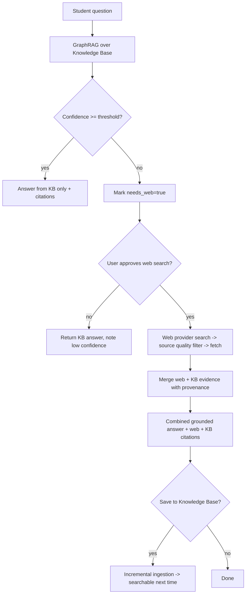
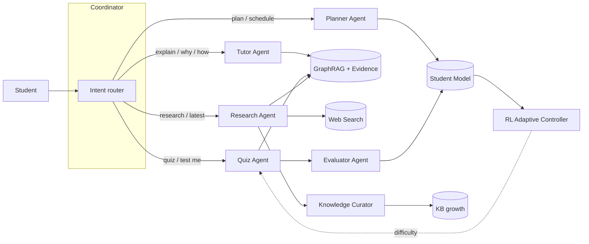

# Phase 2 — Product Enhancement & Production Readiness

This document is the Phase‑2 deliverable: the updated architecture, the complete agent
workflow, the Web Search integration, the RL experiment design, the personalization layer,
a feature checklist, and a demo flow. Everything described as "implemented" is real code,
validated by execution; items marked "planned" are explicitly not yet built.

## 1. Web Search Integration — implemented ✅

Research Mode now has a **working, reliable web-search provider** and environment-based
configuration. The architecture already existed (provider abstraction, source-quality
evaluation, KB+web merge, confidence gating); Phase 2 made it actually work.

- **`WikipediaProvider`** (`src/ala/research/search.py`) — MediaWiki API, **no key**,
  reliable, and **bilingual**: it auto-selects the Arabic or English Wikipedia from the
  query script. This is the default (`config/platform.yaml → research.web_search.provider`).
- Other providers remain available: `tavily` / `google` (API key), `duckduckgo` (no key,
  but frequently challenge-blocked), `local` (offline cache), `disabled`.
- **Environment configuration** (keys never in YAML):
  `ALA_RESEARCH_PROVIDER`, `ALA_RESEARCH_API_KEY`, `ALA_RESEARCH_GOOGLE_CX`,
  `ALA_RESEARCH_MAX_RESULTS` — override config with zero code change.
- **Fail-soft**: any provider error returns `[]`, so an outage never crashes an answer.

**The "KB vs Web vs Both" decision** is the existing `ConfidenceEstimator` gate:

**Validated** (real execution): `What caused the French Revolution?` (out-of-corpus) →
`used_web=True`, confidence 0.18, **3 en.wikipedia.org sources**, 6 citations, merged
answer. In-corpus questions (e.g. `gradient descent`, confidence 0.75) stay KB-only. Web
search is **never automatic** — it requires the low-confidence gate **and** user approval.

## 2. Agent Architecture & Workflow

Seven native agents (no external framework) share **one** GraphRAG retrieval path and the
Student Model. The Coordinator routes free-text by intent and runs a full study session.

**Study-session pipeline** (`AgentService.study_session`): Tutor explains → Quiz asks →
Evaluator grades the answer → Planner recommends next steps → all events update the Student
Model, which feeds the RL difficulty controller.

Current state and Phase‑2 strengthening targets:

| Agent | Implemented | Planned strengthening |
|-------|-------------|------------------------|
| Tutor | Grounded explanations via GraphRAG | Adaptive tone by learner level; auto follow-up question |
| Quiz | One question + key terms + difficulty | **MCQ / True-False / short-answer** types + post-answer explanation |
| Evaluator | Grades answer vs key terms | Partial-credit rubric, misconception detection |
| Planner | Curriculum-ordered roadmap + iCal | Progress-aware re-planning |
| Research | Web search + source validation + merge | Multi-query expansion, summarization pass |
| WebResearch / Curator | Fetch + ingest approved sources | Dedup against existing KB before ingest |

## 3. Personalization Layer — implemented ✅ (extensible)

The Student Model (`src/ala/student/`, SQLite, separate from the KB) already tracks:
courses, per-concept **mastery** (EMA), longitudinal **events** (quiz/exam/lesson/video/
reading/interaction), **weak/strong** concepts, and preferences (level, pace, explanation
style, language). It drives personalized retrieval, the dashboard, recommendations
(Phase‑1 fix), and the planner. Every recommendation is grounded in mastery + graph
structure — no fabricated advice.

## 4. Reinforcement Learning — implemented baseline + experiment design

**Already implemented (Stage 21):** a **LinUCB contextual bandit** (`src/ala/rl/`) that
chooses question difficulty to keep the learner in their Zone of Proximal Development,
with an IRT-based simulated learner for offline evaluation. Benchmarked: contextual
regret **0.167**, beating every fixed-difficulty policy.

**Experiment design (the requested formalization):**

- **Environment:** an adaptive study session. Each step, the system picks a difficulty for
  the next item; the learner responds; mastery updates.
- **State (context `x`):** the learner's mastery of the target concept, recent accuracy,
  attempts, concept centrality in the graph, and preferred pace — a real feature vector
  from the Student Model.
- **Actions:** discrete difficulty arms `[0.2, 0.35, 0.5, 0.65, 0.8]`.
- **Reward:** ZPD-shaped — highest when the item is challenging but attainable
  (success probability ≈ 0.6–0.8), penalizing too-easy (no learning) and too-hard
  (frustration). Signal source: quiz correctness + mastery delta.
- **Algorithm:** LinUCB (implemented) as the online baseline; the upgrade path is a
  contextual Thompson-sampling or a small policy-gradient network once enough real
  interaction data is logged.
- **Integration:** `AdaptiveController` sits between the Evaluator and the Quiz Agent —
  after each graded answer it updates and selects the next difficulty.
- **Evaluation:** cumulative reward / regret vs fixed policies on the IRT simulator (done),
  then A/B on real learners: mastery-gain per session and session completion rate.

## 5. Feature Checklist

| Feature | Status |
|---------|--------|
| AI Chat Assistant (streaming, citations, confidence, evidence) | ✅ working |
| Course summaries (retrieval-backed) | ✅ working |
| Quiz generation (single type) | ✅ working · MCQ/TF/short = planned |
| Semantic + hybrid search | ✅ working |
| **Web search (Research Mode, bilingual)** | ✅ **implemented this phase** |
| KB vs Web vs Both decision (confidence-gated, approval-only) | ✅ working |
| Learning planner (+ iCal) | ✅ working |
| AI agents (7 + coordinator) | ✅ working · deeper strengthening = planned |
| Personalized recommendations | ✅ working |
| Progress tracking (Student Model) | ✅ working |
| Reinforcement learning (LinUCB) | ✅ working baseline |
| Citations / Citation Explorer | ✅ working |
| Admin / Instructor panels | ✅ working |
| UI/UX modern redesign | ⏳ planned (next gated increment) |

## 6. Demo Flow (for presentation)

1. **Login** → land on **Chat**.
2. Ask an in-course question (e.g. *"Explain gradient descent"*) → grounded answer with
   **citations, confidence, evidence** in ~100 ms retrieval.
3. Open a **citation** → jump to the source; open the **Knowledge Base** → click a lecture
   → **retrieval-backed summary**; **Generate Quiz**.
4. Ask an **out-of-course** question (e.g. *"What caused the French Revolution?"*) →
   low confidence → **"This answer requires Web Search"** → **Approve** → merged answer
   with **Wikipedia citations** → optionally **save to Knowledge Base**.
5. Open **Profile** → dashboard: mastery by domain, weak/strong concepts, **recommended
   next steps**, study time.
6. Open **Planner** → generate a roadmap → export calendar.
7. (Instructor login) → **Instructor panel**: cohort mastery, common weak concepts.

## 7. Remaining limitations / next increments

- **UI/UX modern redesign** (landing/dashboard, course cards, chat, planner viz, quiz
  experience, animations) — the largest remaining item; recommended as the next focused
  increment (it revisits the current clean-but-minimal design language).
- **Quiz types** (MCQ / True-False / short answer + explanations) — concrete backend work.
- **Deeper agent strengthening** (adaptive tone, follow-ups, multi-query research).
- Web search quality is best with an **API provider** (`tavily`/`google` + key); Wikipedia
  is the reliable no-key default. Broad-web scraping (DuckDuckGo) is unreliable.
- Full LLM answers require a **pulled Ollama model** (`ollama pull qwen3`); without one the
  grounded extractive generator is used.
