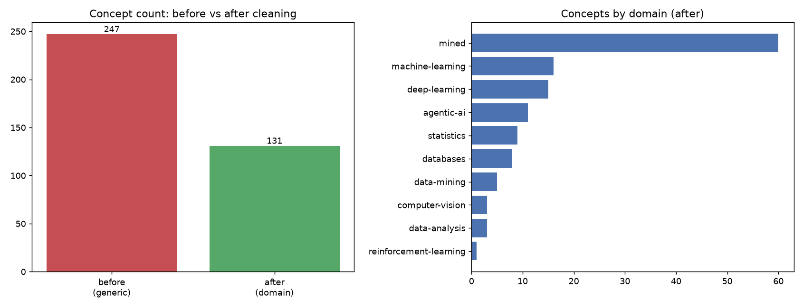
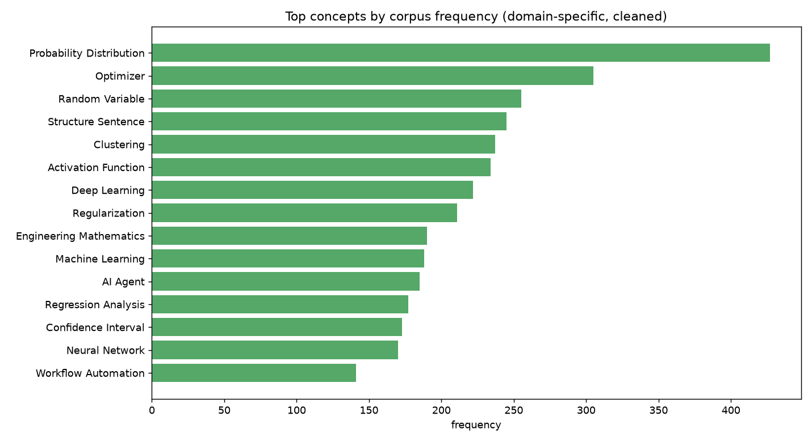
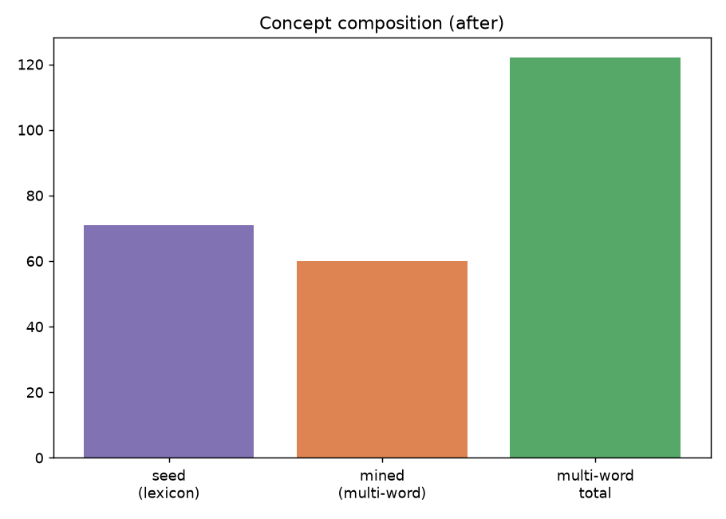

# Stage 10.5 — Concept Extraction Quality Upgrade

**Concepts before cleaning:** 247 (generic-heavy) → **after:** 131 (71 lexicon-matched · 60 embedding-mined · 122 multi-word).

## Removed generic concepts (examples)
data, example, introduction, learning, model, plt, random

## Added multi-word / domain concepts (examples)
SQL Join, Primary Key, Foreign Key, Database Normalization, Relational Model, SQL Query, Database Constraint, Entity-Relationship Model, Association Rule Mining, Pattern Mining, Exploratory Data Analysis, Data Preprocessing, Probability Distribution, Random Variable, Hypothesis Testing, Confidence Interval, Statistical Inference, Mathematical Expectation, Conditional Probability, Regression Analysis

## Most frequent concepts

| concept | domain | frequency | resources |
|---|---|---|---|
| Probability Distribution | statistics | 427 | 67 |
| Optimizer | deep-learning | 305 | 28 |
| Random Variable | statistics | 255 | 25 |
| Structure Sentence | mined | 245 | 26 |
| Clustering | data-mining | 237 | 12 |
| Activation Function | deep-learning | 234 | 29 |
| Deep Learning | deep-learning | 222 | 43 |
| Regularization | machine-learning | 211 | 21 |
| Engineering Mathematics | mined | 190 | 17 |
| Machine Learning | machine-learning | 188 | 41 |
| AI Agent | agentic-ai | 185 | 12 |
| Regression Analysis | statistics | 177 | 30 |
| Confidence Interval | statistics | 173 | 6 |
| Neural Network | deep-learning | 170 | 36 |
| Workflow Automation | agentic-ai | 141 | 12 |

## Largest connected concepts (related_to degree)

| concept | related degree |
|---|---|
| Probability Distribution | 90 |
| Regression Analysis | 81 |
| Deep Learning | 81 |
| Machine Learning | 79 |
| Data Preprocessing | 79 |
| Neural Network | 73 |
| Regularization | 65 |
| Matplotlib Pyplot | 63 |
| Pyplot Plt | 63 |
| Overfitting | 62 |

## Figures
- 
- 
- 
