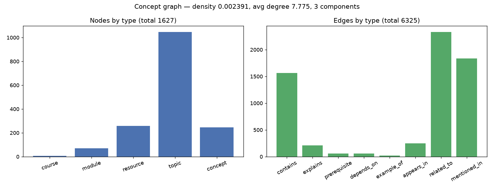
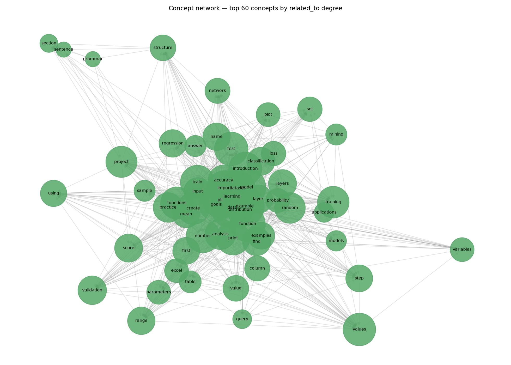
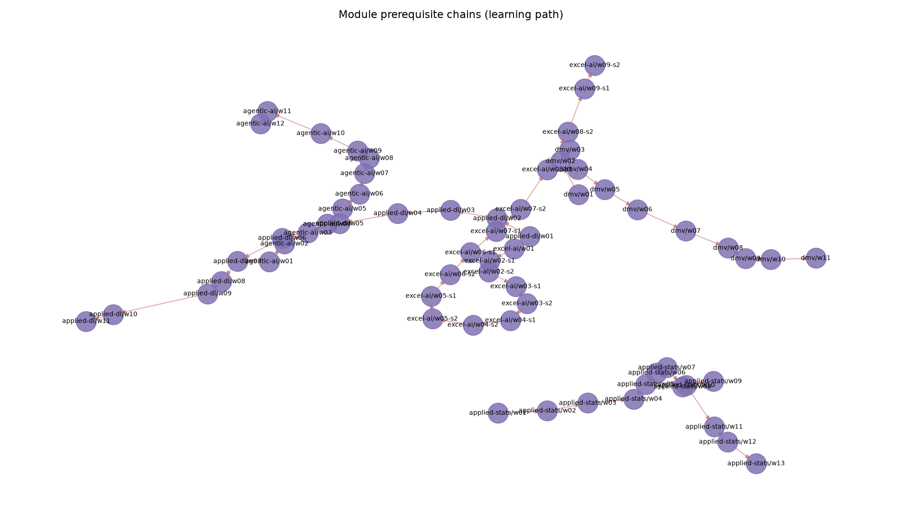

# Stage 10 — Concept Graph: Statistics & Visualizations

Persisted to `D:\Ai tools\data\graph\concept_graph.db` (SQLite). NetworkX in-memory for algorithms.

## Statistics

- **Nodes:** 1627 — {'course': 7, 'module': 70, 'resource': 257, 'topic': 1046, 'concept': 247}
- **Edges:** 6325 — {'contains': 1564, 'explains': 209, 'prerequisite': 59, 'depends_on': 59, 'example_of': 22, 'appears_in': 250, 'related_to': 2329, 'mentioned_in': 1833}
- **Density:** 0.002391 · **Avg degree:** 7.775 · **Weakly-connected components:** 3

### Top-degree nodes

| node | type | degree |
|---|---|---|
| data | concept | 241 |
| model | concept | 146 |
| example | concept | 145 |
| learning | concept | 132 |
| probability | concept | 120 |
| introduction | concept | 101 |
| random | concept | 92 |
| plt | concept | 89 |
| dataset | concept | 88 |
| week03 | resource | 87 |

## Figures
- 
- 
- 
