# Stage 4 — Embedding Pipeline: Benchmark & Evaluation

Sampled **300 real child chunks** across **7 courses** from the ingested corpus.

## Model comparison

| model | dim | n | embed_s | texts/s | compute_mb | bytes/vec | query_ms | coherence | nn_purity |
| --- | --- | --- | --- | --- | --- | --- | --- | --- | --- |
| hashing | 384 | 300 | 6.129 | 48.9 | 3.6 | 1536 | 3.59 | 0.2528 | 0.6967 |
| minilm | 384 | 300 | 5.608 | 53.5 | 4.0 | 1536 | 44.08 | 0.2847 | 0.6267 |
| e5-small | 384 | 300 | 13.934 | 21.5 | 4.3 | 1536 | 72.83 | 0.0724 | 0.74 |

Columns: `embed_s` steady-state embed time (model load excluded via warmup) · `texts/s` throughput · `compute_mb` peak Python allocation during embed · `bytes/vec` storage per vector · `query_ms` mean single-query latency · `coherence` = mean cosine(same-resource) − mean cosine(different-resource) · **`nn_purity`** = fraction of chunks whose nearest neighbour shares the same resource — a rank-based quality signal robust to each model's absolute cosine scale (the fairest cross-model comparison here). Latency reflects a CPU-only sandbox; a GPU would be 1–2 orders of magnitude faster.

## Figures

- 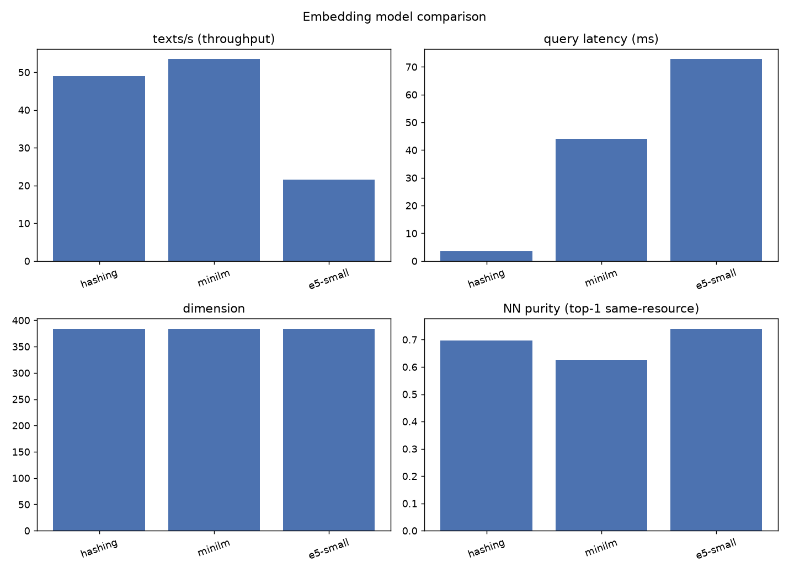
- 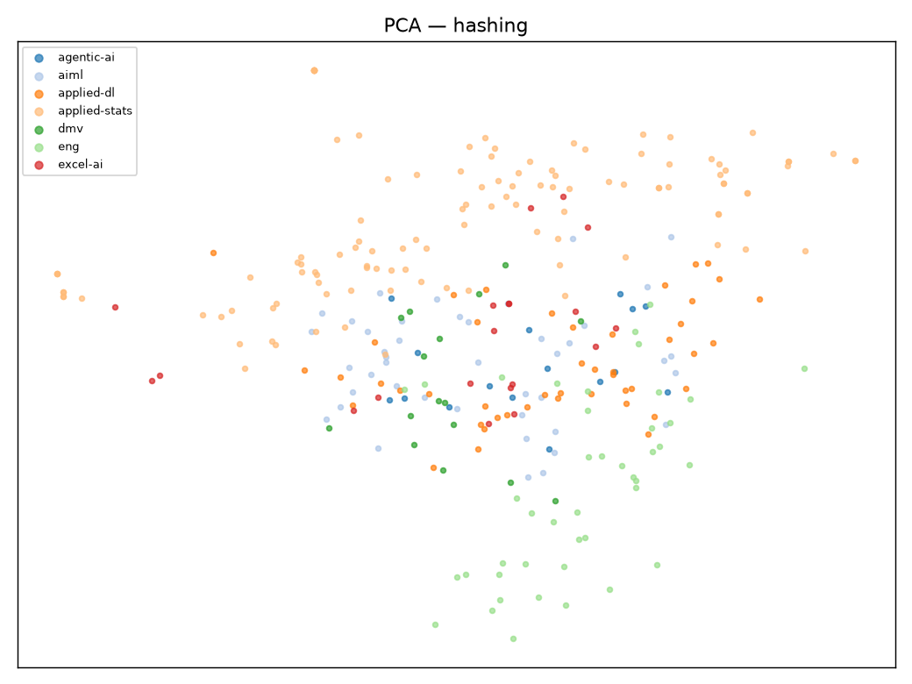
- 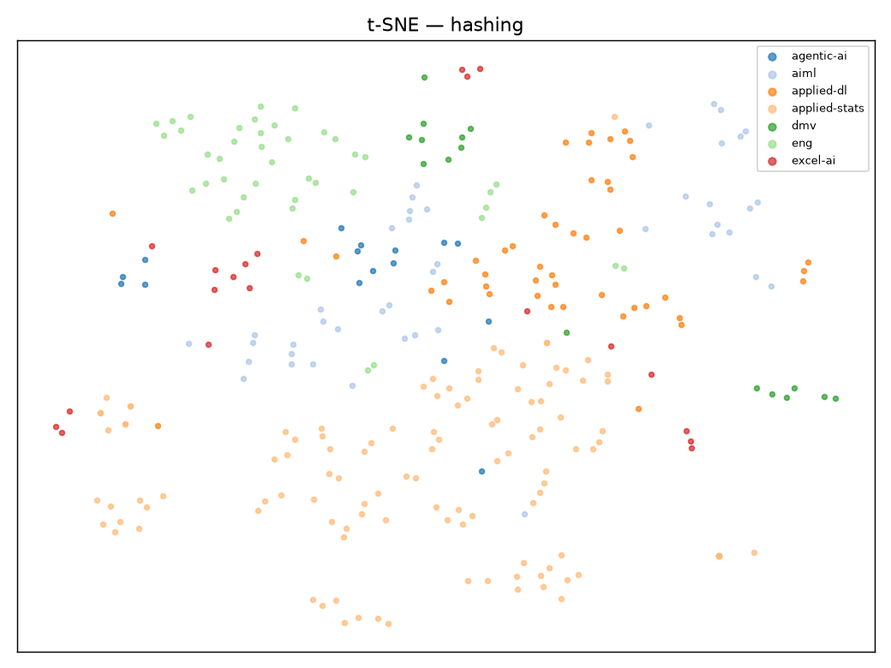
- 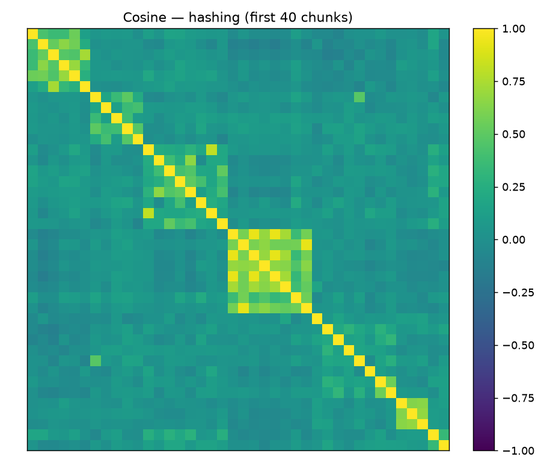
- 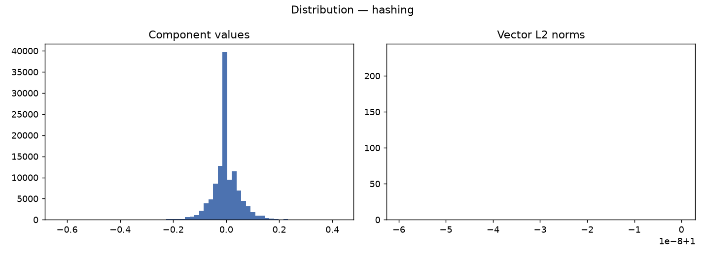
- 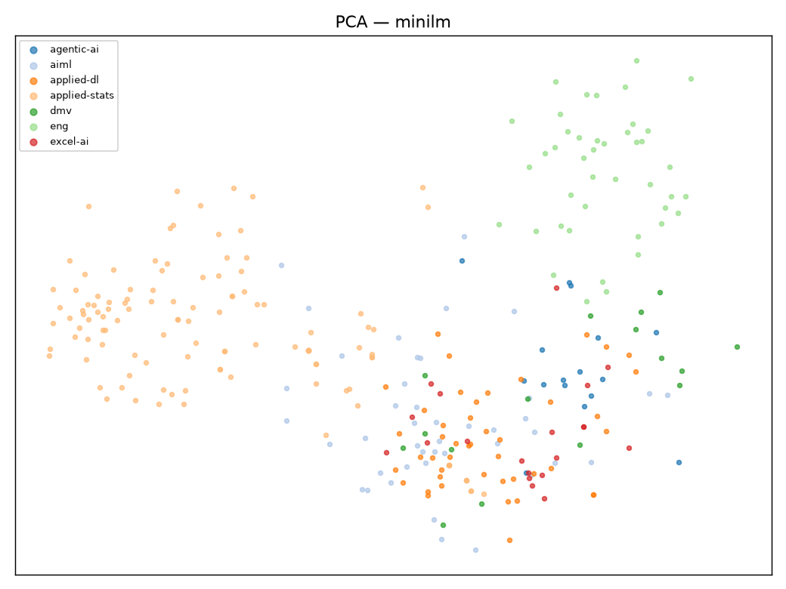
- 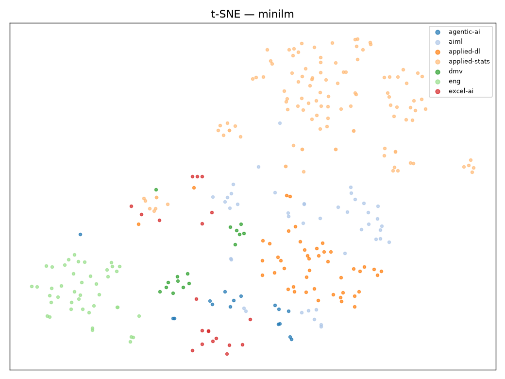
- 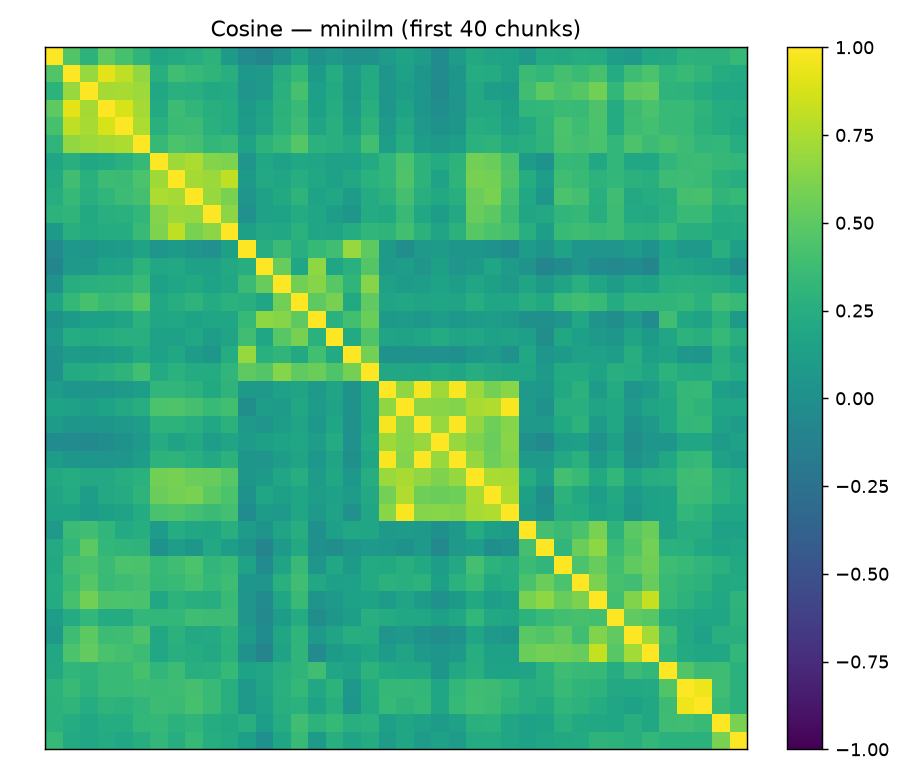
- 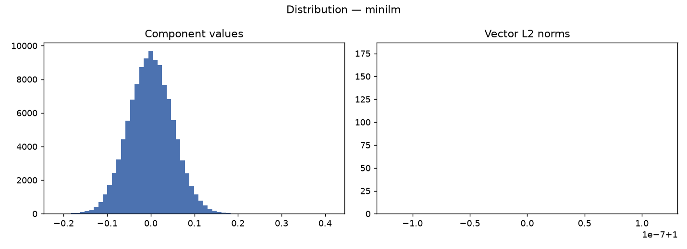
- 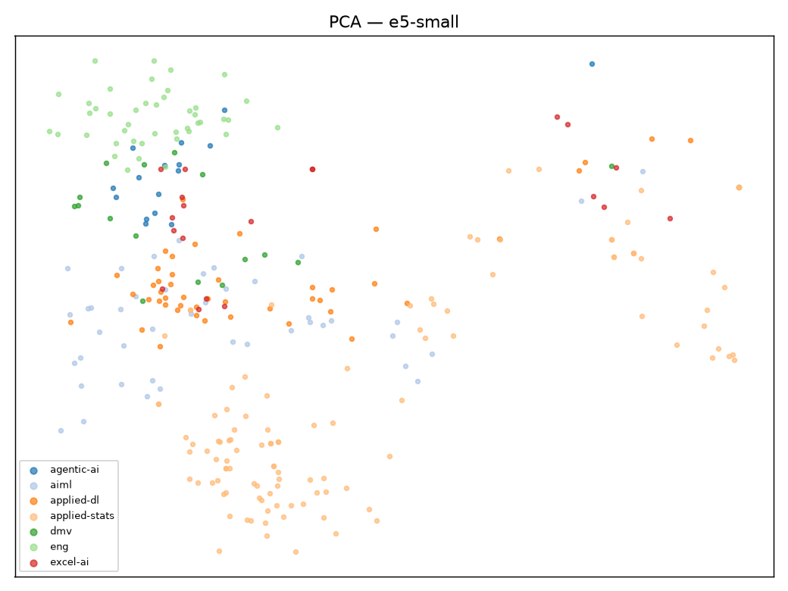
- 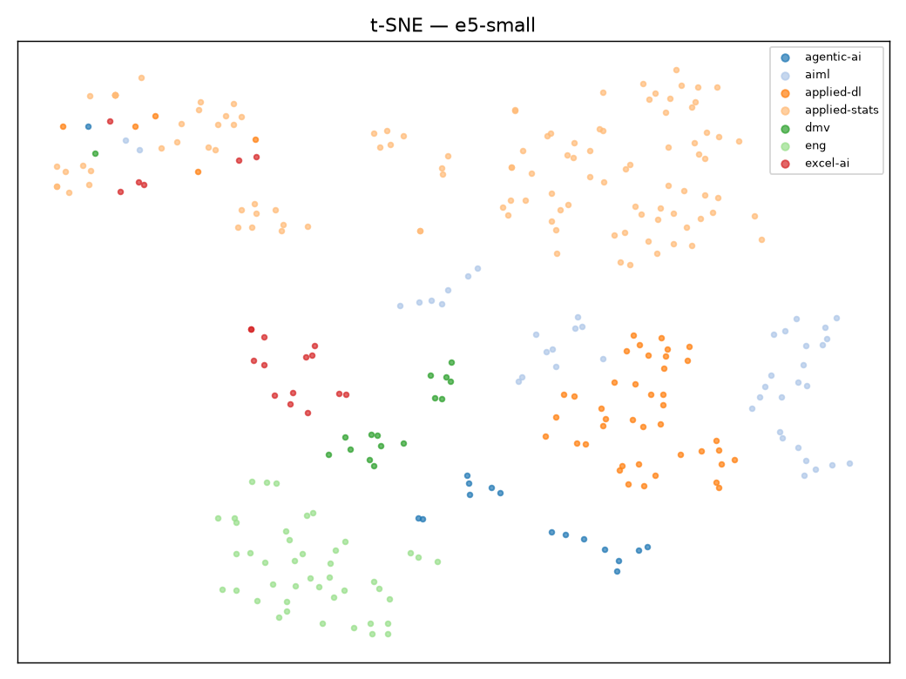
- 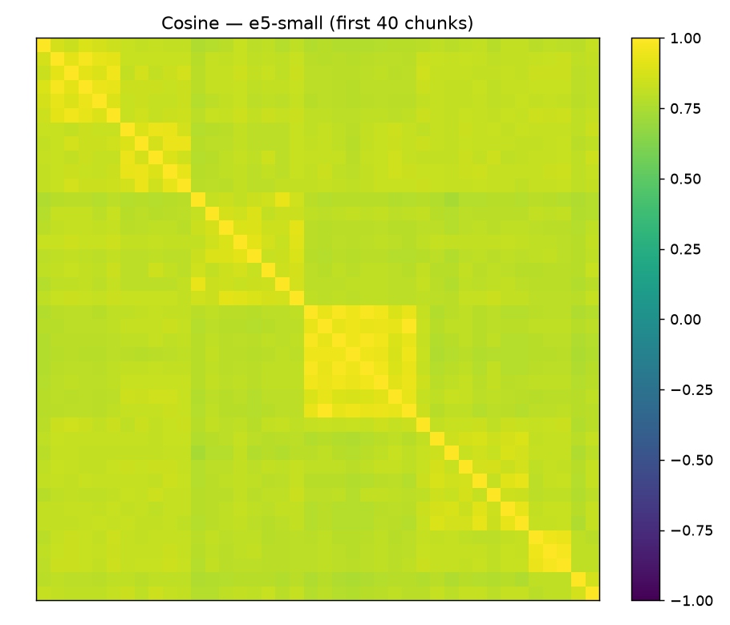
- 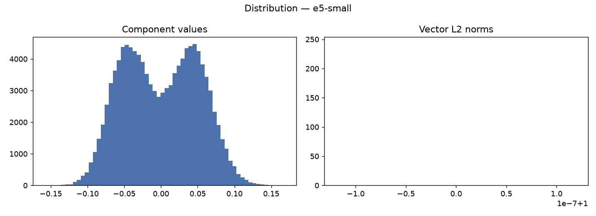
