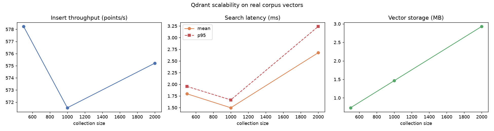

# Stage 5 — Qdrant Vector Store: Benchmark

Model `hashing` · dim 384 · 2500 real corpus vectors · Qdrant local (`:memory:`) mode.

## Scalability (insert throughput + search latency vs collection size)

| n | dim | top_k | insert_s | points/s | search_ms | search_p95_ms | peak_mb | storage_mb |
| --- | --- | --- | --- | --- | --- | --- | --- | --- |
| 500 | 384 | 10 | 0.865 | 578.2 | 1.8 | 1.95 | 4.2 | 0.73 |
| 1000 | 384 | 10 | 1.75 | 571.5 | 1.5 | 1.67 | 7.5 | 1.46 |
| 2000 | 384 | 10 | 3.477 | 575.2 | 2.68 | 3.24 | 14.1 | 2.93 |

`points/s` insert throughput · `search_ms`/`search_p95_ms` query latency at top-k · `peak_mb` peak Python allocation during insert · `storage_mb` raw vector bytes. Latencies are CPU-only local mode; a Qdrant server with HNSW tuning scales further.

## Figures

- 
