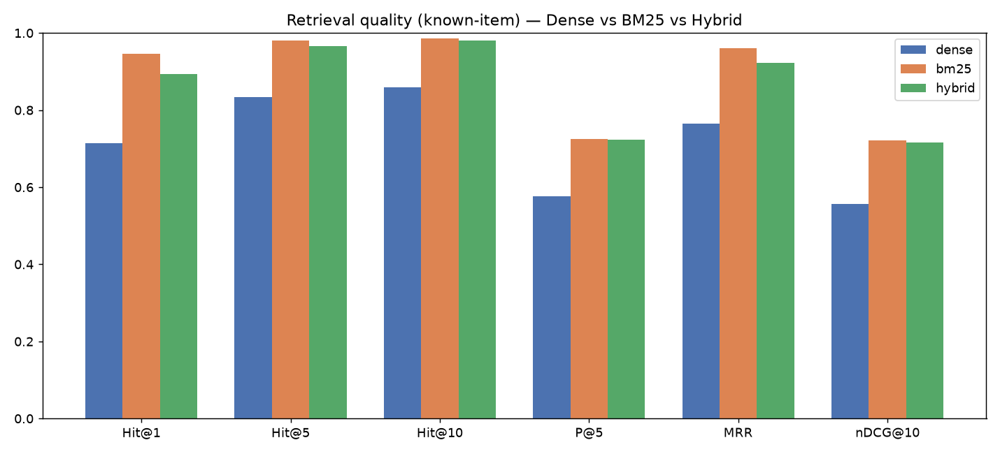
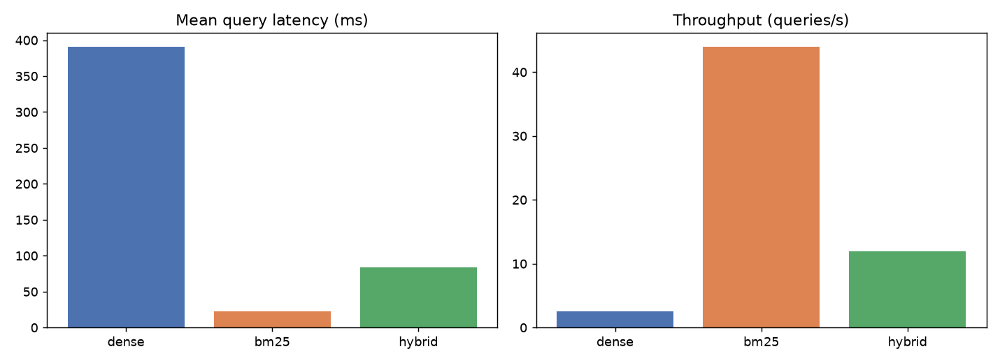
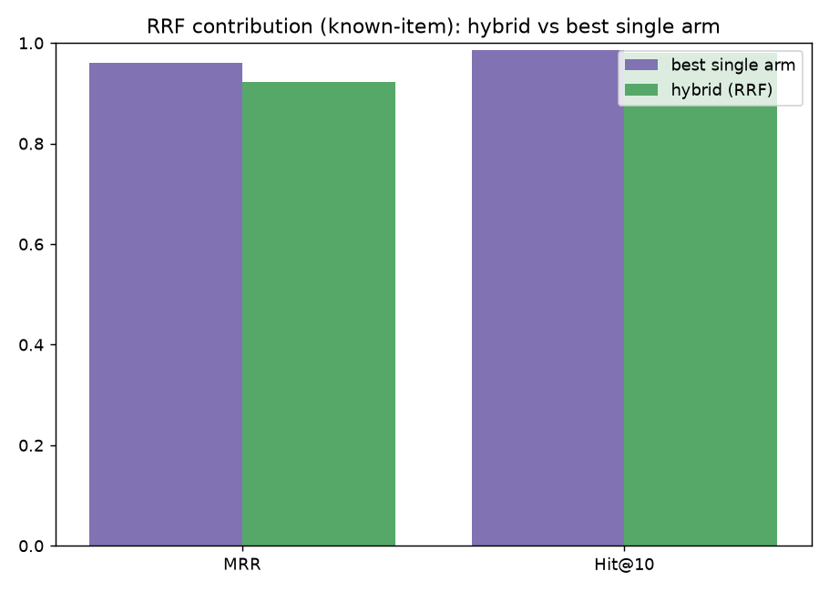
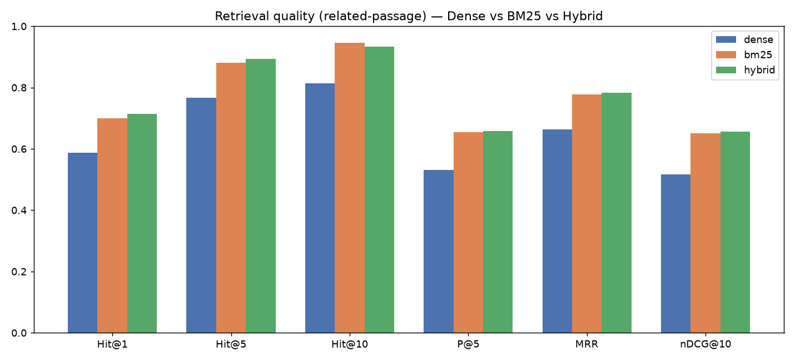
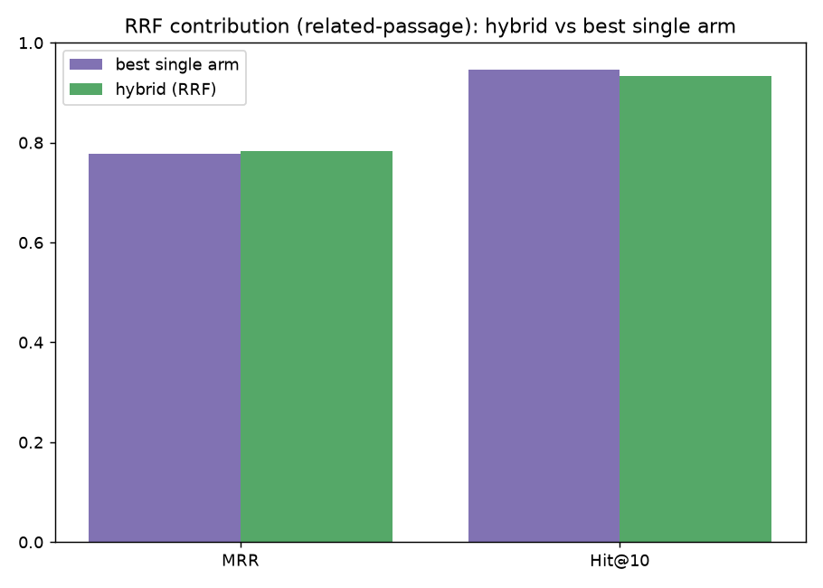
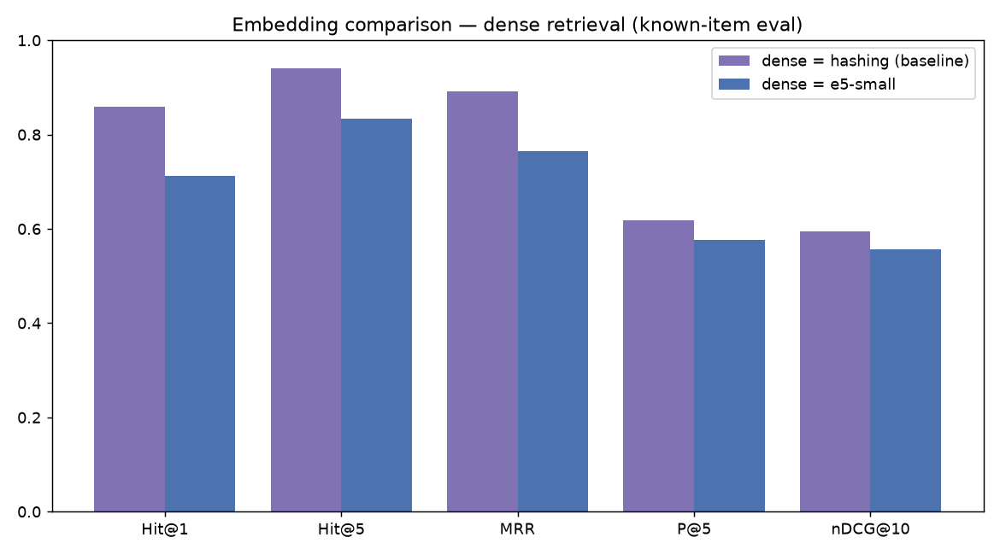

# Stage 6/7/8 — BM25 + Hybrid Retrieval: Evaluation

Dense model: **e5-small**. 150 real corpus queries (a word span from a chunk).

## Eval A — known-item (find the exact source chunk; lexically biased)

| retriever | n | Hit@1 | Hit@5 | Hit@10 | Recall@10 | P@5 | MRR | MAP | nDCG@10 | latency_ms | qps |
| --- | --- | --- | --- | --- | --- | --- | --- | --- | --- | --- | --- |
| dense | 150 | 0.713 | 0.833 | 0.86 | 0.009 | 0.577 | 0.765 | 0.007 | 0.557 | 390.5 | 2.6 |
| bm25 | 150 | 0.947 | 0.98 | 0.987 | 0.018 | 0.725 | 0.96 | 0.015 | 0.721 | 22.76 | 43.9 |
| hybrid | 150 | 0.893 | 0.967 | 0.98 | 0.016 | 0.724 | 0.922 | 0.013 | 0.716 | 83.64 | 12.0 |

BM25 is near-ceiling here because queries are verbatim spans; a semantic model is penalized for retrieving topically-similar chunks from *other* resources.

## Eval B — related-passage (exclude the source chunk; semantic)

| retriever | n | Hit@1 | Hit@5 | Hit@10 | Recall@10 | P@5 | MRR | MAP | nDCG@10 | latency_ms | qps |
| --- | --- | --- | --- | --- | --- | --- | --- | --- | --- | --- | --- |
| dense | 150 | 0.587 | 0.767 | 0.813 | 0.006 | 0.531 | 0.664 | 0.005 | 0.517 | 58.46 | 17.1 |
| bm25 | 150 | 0.7 | 0.88 | 0.947 | 0.014 | 0.655 | 0.778 | 0.01 | 0.651 | 12.27 | 81.5 |
| hybrid | 150 | 0.713 | 0.893 | 0.933 | 0.012 | 0.659 | 0.783 | 0.008 | 0.657 | 80.42 | 12.4 |

The source chunk is removed, so the task is 'find the resource's OTHER passages' — where dense/hybrid contribute. This is the fair test of fusion value.

## Figures

- Known-item:   
- Related-passage:  
- Embedding: 
