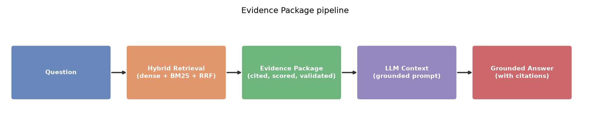
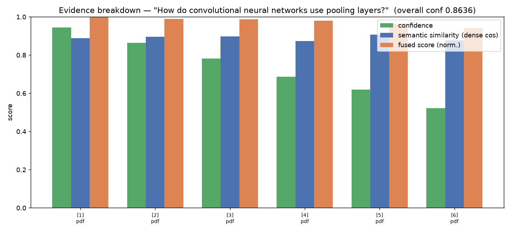

# Stage 9 — Evidence Package: Benchmark & Validation

5 queries · mean build **6082.1 ms** · mean serialized size **11279 bytes** · all packages valid: **True**.

| query | items | confidence | build_ms | peak_kb | bytes | valid |
|---|---|---|---|---|---|---|
| How do convolutional neural networks use pooling | 6 | 0.8636 | 27572.6 | 394414.3 | 11877 | True |
| What is a foreign key and referential integrity? | 6 | 0.8526 | 393.6 | 65928.5 | 10930 | True |
| Explain overfitting and regularization in deep l | 6 | 0.8739 | 759.9 | 65928.4 | 10880 | True |
| What is the difference between primary key and f | 6 | 0.84 | 445.6 | 65928.0 | 10279 | True |
| How does K-means clustering assign points to clu | 6 | 0.8563 | 1238.8 | 65928.0 | 12431 | True |

## Figures
- 
- 

`sample_package.json` is a full serialized Evidence Package.
